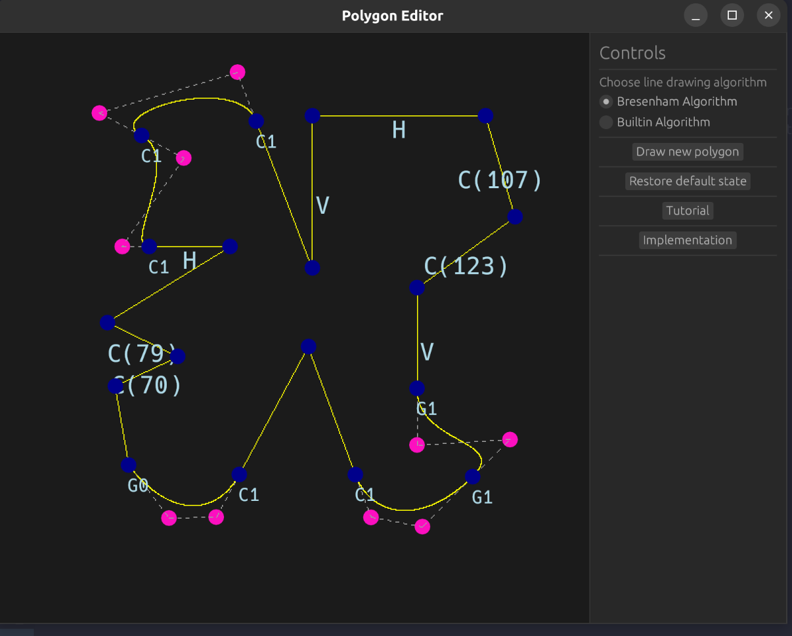
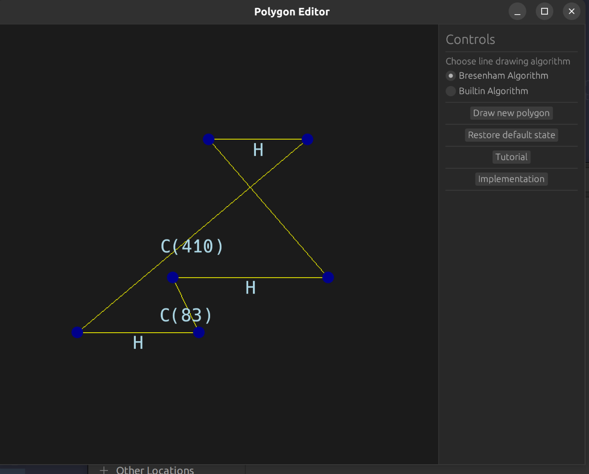
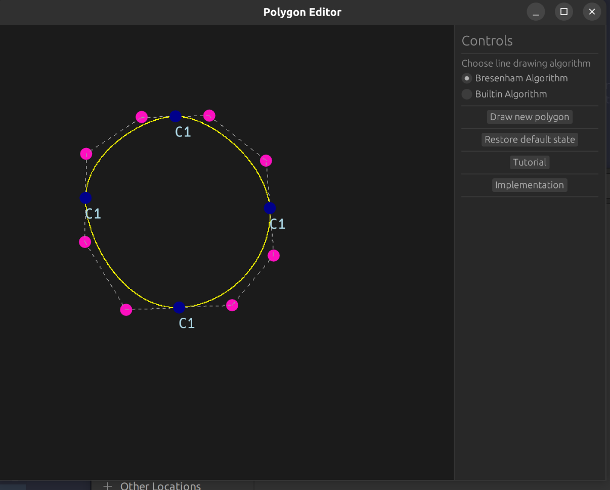

# Polygon Editor

Polygon Editor is a GUI app made with egui for "Computer Graphics 1" course.
It allows the user to draw a polygon consisting of an arbitrary number of points.
Each edge of the polygon can have a constraint applied:
 - vertical
 - horizontal
 - constant width

An edge with a constraint has a proper letter next to it, showing the kind of constraint applied (`V` for vertical, `H` for horizontal, and `C(width)` for constant width).

Each edge can also be turned into cubic Bezier curve. User can manipulate its control points to change its shape. Each point adjacent to Bezier curve can have continuity set to one of the values:
 - `G0`
 - `G1`
 - `C1` (default)  

Continuity in given point is shown by letter next to it.

By default, lines are drawn with the Bresenham algorithm implemented manually, but you can change it to the egui line drawing algorithm using the controls in the right panel.

## How to use it
You can learn how to use app and its features by clicking on `Tutorial` button in the right panel.

## Running 

### Prerequisites
- rust >= `1.81`

Enter projects root directory and run
```shell
cargo run --release
```

## Examples



